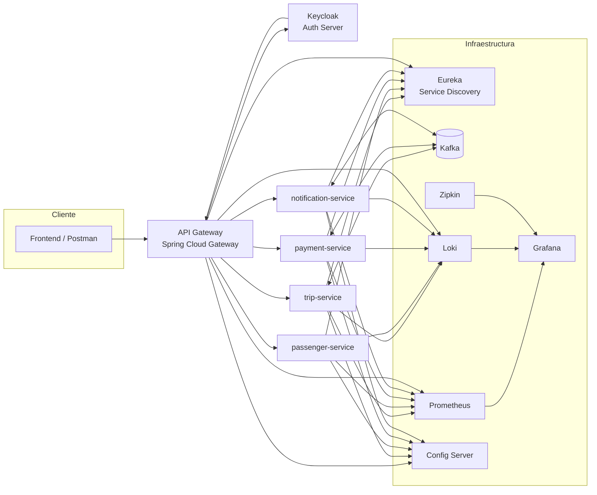
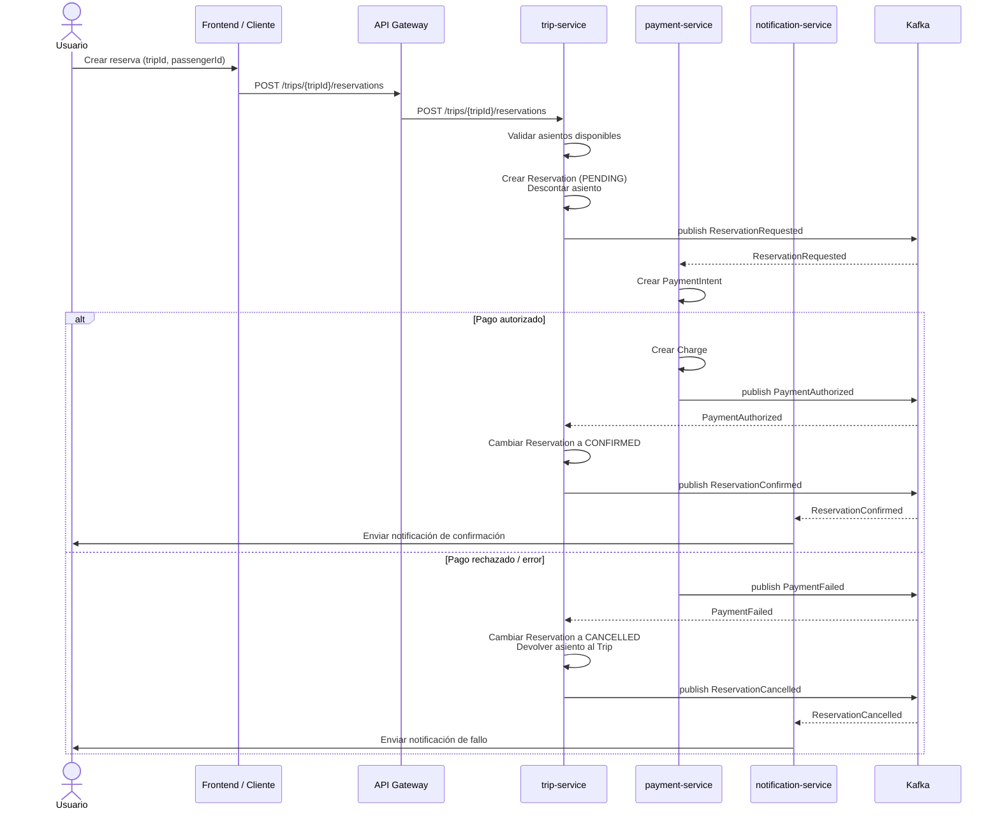

# 📊 Diagramas de Arquitectura & Saga – ECO RIDE LATAM

> ⚠️ Nota: Todos los microservicios cargan su configuración desde **Config Server**, usando:
>
> ```
> spring.config.import=optional:configserver:http://localhost:8888
> ```
>
> Cada microservicio tiene su propio archivo en:
> `/config/<service-name>.yml` dentro del config-server.

---

## 🏗️ Arquitectura General (Microservicios + Infraestructura)


---
## 🔁 Diagrama de Saga de Reserva (Mermaid)


---
🚀 Resumen de microservicios (vía Gateway)
| Microservicio            | Rutas principales                              |Puertos |
| ------------------------ | ---------------------------------------------- |--------|
| **trip-service**         | `/trips/**`, `/reservations/**`                |8082    |
| **passenger-service**    | `/passengers/**`, `/drivers/**`, `/ratings/**` |8083    |
| **payment-service**      | `/payments/**`, `/charges/**`, `/refunds/**`   |8084    |
| **notification-service** | `/notifications/**`                            |8085    |
| **Gateway actuator**     | `/actuator/**`                                 |8080    |
---
