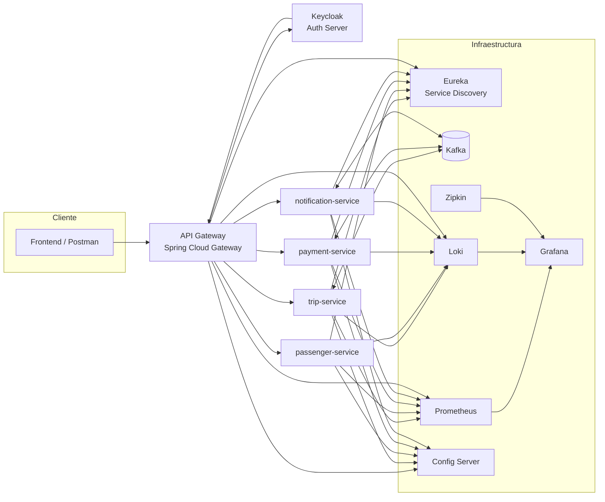
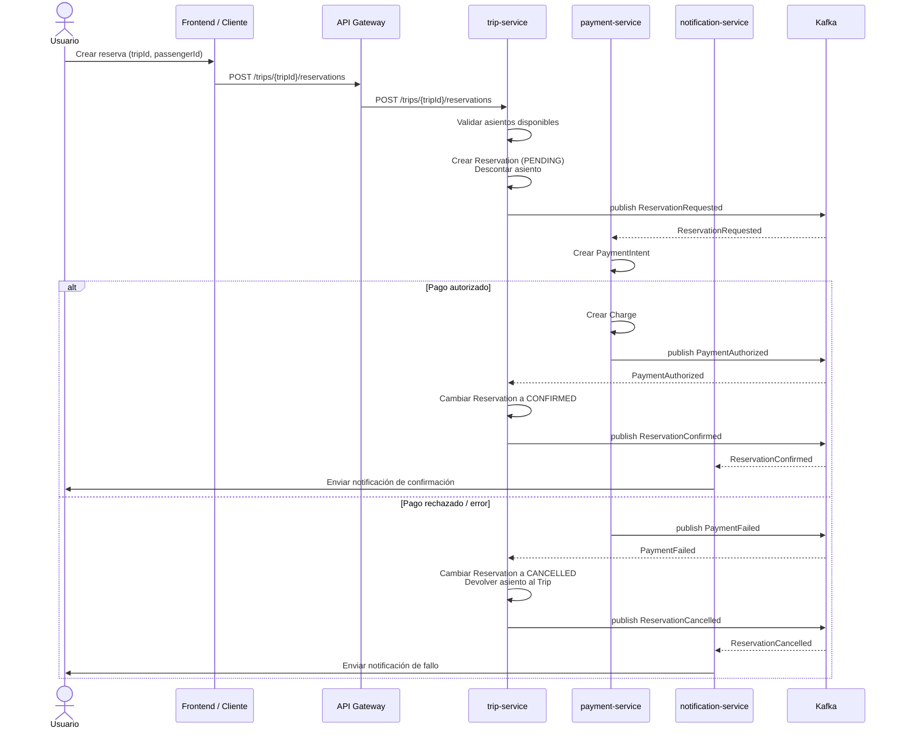

# 🚕 Eco Ride Latam V2

Bienvenido a **Eco Ride Latam V2**, una plataforma de transporte basada en una arquitectura de microservicios resiliente y escalable.


## 📚 Documentación

Hemos preparado guías detalladas para ayudarte a entender, ejecutar y desplegar el proyecto:

*   **🛠️ [Guía de Instalación y Configuración](SETUP_GUIDE.md)**: Pasos paso a paso para ejecutar el proyecto localmente.
*   **📡 [Referencia de API](API_REFERENCE.md)**: Documentación de los endpoints principales de cada microservicio.
*   **🚢 [Guía de Despliegue](DEPLOYMENT.md)**: Instrucciones para desplegar usando Docker y Docker Compose.

---

> ⚠️ Nota: Todos los microservicios cargan su configuración desde **Config Server**, usando:
>
> ```
> spring.config.import=optional:configserver:http://localhost:8888
> ```
>
> Cada microservicio tiene su propio archivo en:
> `/config/<service-name>.yml` dentro del config-server.

## 🏗️ Arquitectura General




---

## 🔁 Patrón Saga (Reserva de Viajes)

Gestionamos la consistencia de datos distribuidos mediante el patrón **Saga Orquestada** (vía Kafka).



---

## 🚀 Servicios Principales

| Microservicio | Puerto | Descripción |
| :--- | :--- | :--- |
| **API Gateway** | `8080` | Punto de entrada único. |
| **Trip Service** | `8082` | Gestión de viajes y orquestación de Sagas. |
| **Passenger Service** | `8083` | Gestión de usuarios y conductores. |
| **Payment Service** | `8084` | Procesamiento de pagos. |
| **Notification Service** | `8085` | Envío de correos y notificaciones. |
| **Discovery Server** | `8761` | Eureka Server. |
| **Config Server** | `8888` | Configuración centralizada. |

Para más detalles sobre los endpoints, consulta la [Referencia de API](API_REFERENCE.md).

---

## 🧱 Orden de ejecución recomendado

1️⃣ **Discovery Service**  
Servicio de registro (Eureka). Todos los demás dependen de él.  

2️⃣ **Config Server**  
Debe iniciar después de Eureka, ya que todos los servicios cargarán su configuración desde aquí.  

3️⃣ **API Gateway**  
Depende de Eureka + Config Server.  

4️⃣ **Notification Service**  
Usa Config Server + Eureka y escucha eventos Kafka.  

5️⃣ **Passenger Service**  
Carga configuración y se registra en Eureka.  

6️⃣ **Payment Service**  
Crítico para la Saga y depende de Kafka + Eureka + Config Server.  

7️⃣ **Trip Service**  
Depende de todos los anteriores (Kafka, Eureka, Config Server) para ejecutar la Saga completa.

---

## 👨🏼‍💻 Autores
**JONATHAN VEGA** , **BRAULIO TOVAR**
